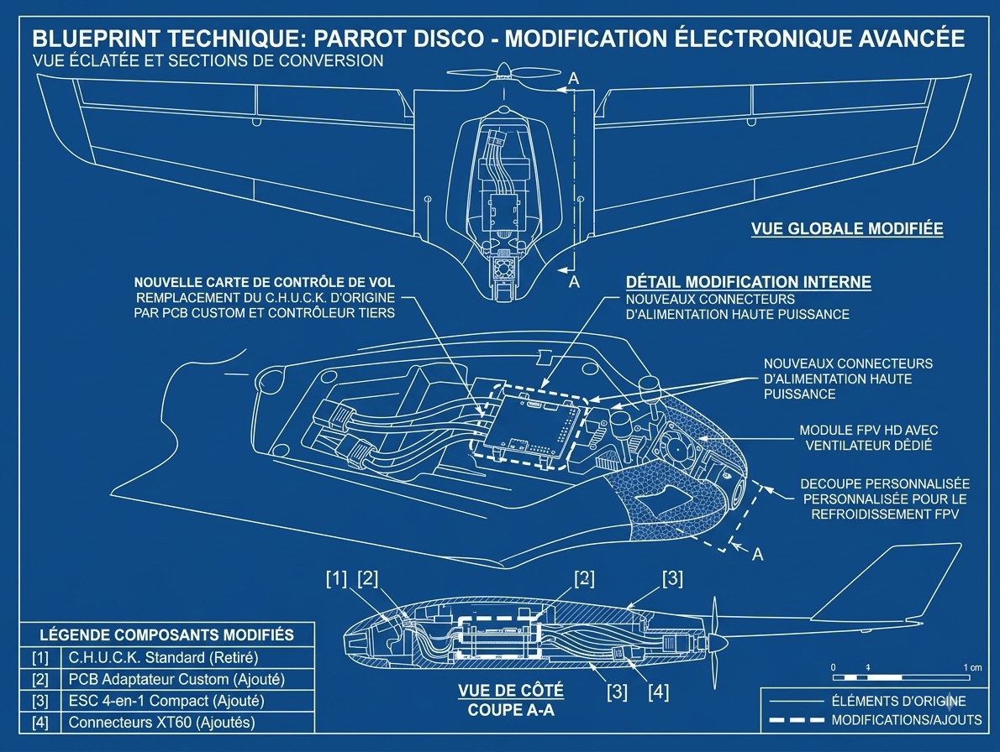

# Parrot Disco – DJI O4 Pro + Matek F405 Mod

🇬🇧 English | 🇫🇷 [Lire en français](README.fr.md)

Full conversion of the Parrot Disco: removal of the original chuck, integration of a **DJI O4 Pro** digital video system and a **Matek F405** flight controller, with custom 3D-printed mounts.

## 🎯 Project overview

- **Why this mod?** Replacing Parrot's proprietary electronics with a modern, open, and repairable stack (O4 Pro long-range video + INAV flight controller).
- **Benefits**: removal of the chuck (weight/space savings), digital long-range video, fully customizable flight tuning via INAV.
- **Status**: ✅ Working

## ✈️ Result

[First flight video]([LIEN_VIDEO](https://youtu.be/oAaKVsJd3Pc?si=X5Niqoi7fkNdR0t8))

## 🛠️ Hardware used

| Component | Reference | Buy link |
|---|---|---|
| Video system | DJI O4 Pro | [LINK](https://www.lacameraembarquee.fr/dji-o4-air-unit-goggles/17819-dji-o4-air-unit-pro-6941565997449.html) |
| Flight controller | Matek F405 | [LINK](https://www.drone-fpv-racer.com/controleur-de-vol-f405-wing-v2-matek-11770.html) |
| RC receiver | DJI O4 Pro | [LINK](https://www.lacameraembarquee.fr/dji-o4-air-unit-goggles/17819-dji-o4-air-unit-pro-6941565997449.html) |
| ESC | 20A | [LINK](https://www.amazon.fr/HAWKS-WORK-ESC-R%C3%A9gulateur-%C3%A9lectrique/dp/B0B25DLFZ2) |
| Battery | 3S 2200mAh | [LINK](https://www.lacameraembarquee.fr/batteries-fpv/15885-batterie-lipo-cnhl-black-series-3s-2200mah-40c.html) |
| Other (connectors, wiring, etc.) | | [LINK] |
| GPS M10 | | [LINK](https://www.drone-fpv-racer.com/module-gps-m10-glonass-tbs-12411.html) |
| Dupont cables | | |
| Brass inserts for 3D printing | | |
| 2.5mm screws | | |
| 30mmx30mm 5V fan | | |

## 🖨️ 3D printed parts

All parts are available for download/purchase at:

- **Cults3D**: [LINK](https://cults3d.com/fr/mod%C3%A8le-3d/jeu/parrot-disco-2026-mod-full-fpv)

| Part | Function | Recommended material | File |
|---|---|---|---|
| O4 Pro mount | VTX mounting | PETG/PLA | `stl/support_o4pro.stl` |
| Matek F405 mount | FC mounting + vibration damping | PETG/PLA | `stl/support_fc.stl` |
| Camera mount | Camera mounting | PLA/PETG | `stl/support_camera.stl` |

**Recommended print settings** *(adjust based on your own tests)*:
- Layer height: 0.2 mm
- Infill: 20–30%
- Wall count: 3
- Supports: *(yes/no depending on part)*

## 🔌 Wiring

Detailed FC ↔ O4 Pro ↔ receiver connections: see [`docs/wiring.md`](docs/wiring.md)

## ⚙️ INAV settings

Configuration file directly importable into the INAV Configurator:

📄 [`inav/disco_o4pro.txt`](inav/disco_o4pro.txt) — *(full dump via CLI `diff all`)*

Key configuration points:
- **Mixer**: fixed-wing profile, type *(to specify: DIFFERENTIAL_THRUST, etc.)*
- **Flight modes**: *(ANGLE, NAV_ALTHOLD, RTH, etc.)*
- **Failsafe**: *(recommended specific settings)*
- **PID**: values tuned for the weight/inertia of the modified Disco

> ⚠️ These settings are a starting point, not a universal config. Adjust for your own build and test in safe conditions.

## 📋 Build guide

1. Removing the original C.H.U.C.K
2. Printing and preparing the 3D mounts
3. Installing the Matek F405 + wiring
4. Installing the DJI O4 Pro
5. Flashing and configuring INAV
6. Calibration (accelerometer, compass, ESC)
7. Ground tests before the first flight

Full details: [`docs/guide-montage.md`](docs/guide-montage.md)

## ⚠️ Disclaimer

This mod involves flying with firmware and hardware not approved by Parrot. Proceed at your own risk, comply with applicable drone regulations in your country, and never fly over people or sensitive areas.

## 📬 Contact / Order

- Ready-to-use printed parts: reach out by email
- Technical questions: email

