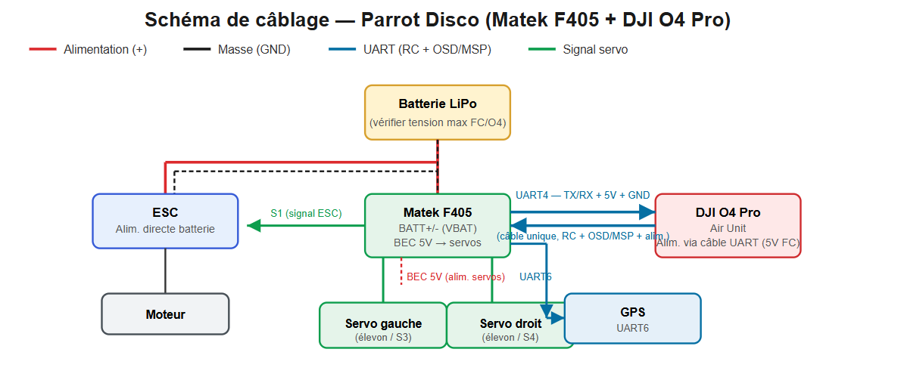

# Parrot Disco – DJI O4 Pro + Matek F405 Mod

<!-- Remplace par une belle photo/GIF du Disco modifié en vol -->

Modification complète du Parrot Disco : suppression du chunk d'origine, intégration d'un système vidéo **DJI O4 Pro** et d'un contrôleur de vol **Matek F405**, avec pièces 3D imprimées sur-mesure.

## 🎯 Présentation du projet

- **Pourquoi ce mod ?** Remplacement de l'électronique propriétaire Parrot par une stack moderne, open et réparable (vidéo longue portée O4 Pro + contrôleur de vol INAV).
- **Gains** : suppression du chuck (poids/encombrement), vidéo numérique longue portée, réglages de vol personnalisables via INAV.
- **Statut** : ✅ Fonctionnel 

## ✈️ Résultat

<!-- Lien YouTube/Reddit si tu as une vidéo de vol -->
[Vidéo du premier vol](LIEN_VIDEO)

## 🛠️ Matériel utilisé

| Composant | Référence | Lien d'achat |
|---|---|---|
| Système vidéo | DJI O4 Pro | [LIEN] |
| Contrôleur de vol | Matek F405 | [LIEN] |
| Récepteur RC | DJI O4 Pro | [LIEN] |
| ESC | 20A | [LIEN] |
| Batterie | 3S 2200mah | [LIEN] |
| Autre (connecteurs, câblage, etc.) | | [LIEN] |

## 🖨️ Pièces imprimées 3D

Toutes les pièces sont disponibles en téléchargement/achat sur :

- **Cults3D** : [[LIEN]](https://cults3d.com/fr/mod%C3%A8le-3d/jeu/parrot-disco-2026-mod-full-fpv)

| Pièce | Fonction | Matériau conseillé | Fichier |
|---|---|---|---|
| Support O4 Pro | Fixation caméra/VTX | PETG/PLA | `stl/support_o4pro.stl` |
| Support Matek F405 | Fixation FC + amortissement vibrations | PETG/PLA | `stl/support_fc.stl` |
| Cache chunk | Remplacement esthétique/aéro | PLA/PETG | `stl/cache_chuck.stl` |

**Paramètres d'impression recommandés** *(à adapter selon tes tests)* :
- Hauteur de couche : 0.2 mm
- Remplissage : 20–30%
- Parois : 3
- Support : *(oui/non selon pièce)*

## 🔌 Câblage

<!-- Schéma de câblage, image ou diagramme -->

Détail des connexions FC ↔ O4 Pro ↔ récepteur : voir [`docs/wiring.md`](docs/wiring.md)

## ⚙️ Réglages INAV

Fichier de configuration exportable directement dans le INAV Configurator :

📄 [`inav/disco_o4pro.txt`](inav/disco_o4pro.txt) — *(dump complet via CLI `diff all`)*

Points clés de configuration :
- **Mixer** : profil fixed-wing, type *(à préciser : DIFFERENTIAL_THRUST, etc.)*
- **Modes de vol** : *(ANGLE, NAV_ALTHOLD, RTH, etc.)*
- **Failsafe** : *(réglages spécifiques recommandés)*
- **PID** : valeurs ajustées pour la masse/inertie du Disco modifié

> ⚠️ Ces réglages sont un point de départ, pas une config universelle. Ajuste selon ton propre montage et fais tes tests en conditions sûres.

## 📋 Guide de montage

1. Démontage du C.H.U.C.K d'origine
2. Impression et préparation des supports 3D
3. Installation Matek F405 + câblage
4. Installation DJI O4 Pro
5. Flash et configuration INAV
6. Calibration (accéléromètre, compas, ESC)
7. Tests au sol avant premier vol

Détails complets : [`docs/guide-montage.md`](docs/guide-montage.md)

## ⚠️ Avertissement

Ce mod implique de voler avec un firmware et un matériel non homologués par Parrot. À réaliser en connaissance de cause, dans le respect de la réglementation drone en vigueur (DGAC / réglementation locale), et jamais au-dessus de personnes ou zones sensibles.

## 📬 Contact / Commander

- Pièces imprimées prêtes à l'emploi : me faire la demande par Email 
- Questions techniques : Email

## 📄 Licence

*(ex: MIT pour le code/configs, CC-BY-NC pour les fichiers 3D — à définir selon ta volonté commerciale)*
